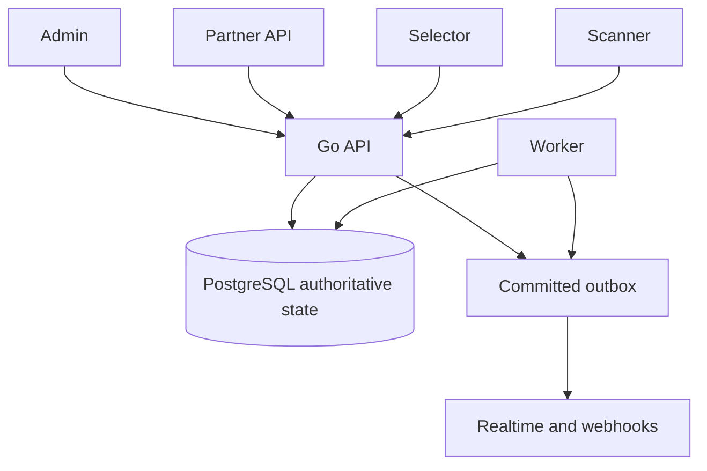

# TktSync

TktSync is neutral ticket-inventory infrastructure that lets multiple independent ticketing Partners sell from one authoritative Event inventory without overselling.

## Why TktSync exists

When several sellers offer the same seats or general-admission capacity, each seller's local availability view can become stale. Two checkouts can then appear to win the same inventory. TktSync puts the lock, Reservation, Sale, Ticket, and Admission decisions behind one transactional authority so every Partner competes against the same committed state.

## Responsibility boundaries

TktSync owns authoritative live inventory, seat and general-admission locking, Reservations, Sale confirmation, Ticket identity, QR generation/hosting/validity, duplicate Admission prevention, audit, and Partner reporting.

Partners own buyer checkout, payment, the customer relationship, branding, service fees, customer communication, and the final ticket presentation. TktSync hosts the QR image, not a full customer ticket page. Event owners own venue staffing, gates, physical security, and other physical operations.

Self-serve Partner onboarding, payment processing, a hosted branded ticket page, and native mobile applications are outside the MVP.

## Core invariants

- There is one authoritative inventory truth.
- Availability is not ownership; only a successful Reservation acquires inventory.
- Partner payment is not a Ticket until TktSync confirms the Reservation.
- Retriable mutations are idempotent.
- Realtime improves freshness but never replaces authoritative reads or commands.
- Scanner decisions are online-authoritative.
- Ambiguous ownership or authority fails closed.

## System at a glance



Frontend state is a presentation of authority, never the authority itself.

## Transaction journey

Availability → Reservation → checkout protection → Partner payment → confirmation → Ticket plus hosted QR → Scanner Admission.

The Partner performs payment while a TktSync Reservation protects inventory. Confirmation atomically creates the Sale and Tickets. The `qr1` credential remains the Scanner input; the opaque hosted URL renders only that QR image for Partner-owned delivery.

## Local setup — Docker

Docker with Compose is the only prerequisite for the complete local stack.

```sh
cp .env.example .env
make local-up
docker compose ps --all
```

Default URLs:

- API: http://localhost:58480 (`/health` and database-backed `/ready`)
- Admin: http://localhost:54470
- Selector: http://localhost:54471
- Scanner: http://localhost:54472
- Partner Docs: http://localhost:54473
- PostgreSQL: `localhost:55439`

Compose starts PostgreSQL, applies all ordered migrations, runs the idempotent application seed, and then starts the API, Worker, and four web applications. Useful commands are `make local-logs`, `make local-seed`, `make local-down`, and the destructive local-only `make local-reset`.

The published ports are configured with `API_HOST_PORT`, `ADMIN_HOST_PORT`, `SELECTOR_HOST_PORT`, `SCANNER_HOST_PORT`, `DOCS_HOST_PORT`, and `POSTGRES_PORT`. Compose keeps container ports fixed and derives browser/API URLs from those host ports. Override a host port before building, for example:

```sh
API_HOST_PORT=59480 SELECTOR_HOST_PORT=55471 make local-up
```

Admin and Scanner human sign-in require an external Supabase Auth project. Set the public Supabase values and matching server-side JWT issuer/JWKS settings described in [.env.example](.env.example). `SUPABASE_SECRET_KEY` is server-only and is required only for Admin invitations. `LOCAL_OPERATOR_AUTH_SUBJECT` authorizes an existing Supabase user's JWT subject; seeds never receive or store a password.

Partner checkout-return URLs are registered by a Platform Admin during Partner onboarding. Production return URLs must use HTTPS; local loopback HTTP is for development only. Supabase invite/password-return URLs must separately be allowlisted in the Supabase project.

Use the [local smoke checklist](docs/operations/local-smoke-checklist.md) for the short operator verification.

## Local setup — native development

Install Node.js 22+, pnpm 10+, Go 1.25+, Docker, and Docker Compose, then run:

```sh
cp .env.example .env
make setup
make db-up
make db-migrate
make dev
```

`make dev` runs the API, Worker, Admin, Selector, and Scanner. Run `make dev-docs` separately for Partner Docs. If `POSTGRES_PORT` is changed for native development, update the host-facing `DATABASE_URL` in `.env` to match.

## Default Event transaction profile

New Events receive these editable defaults; they are policy defaults, not immutable platform limits:

- hold: 600 seconds
- checkout protection: 120 seconds
- payment retry: 300 seconds
- reconciliation: 600 seconds
- maximum Reservation lifetime: 1,800 seconds
- maximum hold quantity: 12
- maximum active Reservations per Partner: 500
- maximum active Reservations per buyer session: 3
- automatic resale of voided inventory: false

See [Platform Policy](docs/architecture/platform-policy.md) for the governing semantics.

## Concurrency and horizontal scaling

Each API process accepts up to `HTTP_MAX_IN_FLIGHT=200` ordinary requests by default. Each Worker process defaults to Reservation concurrency 2 with batch 100, outbox concurrency 2 with batch 100, and webhook concurrency 4 with batch 50. The PostgreSQL pool defaults to maximum 20 and minimum 2 connections per process.

Go provides cheap goroutine concurrency inside each process. TktSync does not create horizontal replicas: the deployment runtime scales API and Worker processes. Independent Worker replicas coordinate through PostgreSQL row locking, `SKIP LOCKED`, idempotency, and webhook leases/fencing; there is no in-process Worker leader. Replica counts must be budgeted against the per-process database pool.

The detailed lifecycle, scaling, pool-budget, failure, and observability model is in the [Production Runtime Model](docs/operations/runtime-model.md). Its local loopback measurement covers HTTP middleware only and is not production domain throughput.

## Security model

- Supabase authenticates human Admin and Scanner users; TktSync authorizes their application roles.
- Partner credentials remain on Partner servers and are never browser credentials.
- The Selector consumes and removes its fragment selection capability before network requests.
- Reservation continuation tokens are sent in headers or form bodies, never URLs.
- A hosted QR URL is a credential-bound bearer presentation capability. Reissue invalidates the old `qr1` payload and old hosted URL, and retrieval returns a new pair.
- TktSync validates the embedded `qr1` payload online against Ticket, credential, Event, and Admission state.
- Credentials, tokens, capabilities, and keys are excluded from logging and browser telemetry.

See [Security and Authentication](docs/architecture/security.md) for the complete threat and control model.

## Verification

GitHub CI has three substantive gates: Go static/unit/build checks, frontend contract/lint/type/test/build/E2E checks, and PostgreSQL integration/certification checks. The release job requires all three.

Common local gates:

```sh
pnpm lint
pnpm typecheck
pnpm test
pnpm build
pnpm format:check
pnpm api:check
pnpm api:routes
pnpm docs:check
pnpm e2e
make verify-fresh-database
make certify-partner-integration
```

Production code never creates schema dynamically. Ordered migrations live in `migrations/`. Never commit `.env`, signing/encryption keys, Partner credentials, database passwords, or other secrets.

## Repository layout

- `apps/` — four React/Vite applications: Admin, Selector, Scanner, and Partner Docs
- `backend/` — authoritative Go API, Worker, and domain/application code
- `packages/` — shared UI primitives and generated API client
- `migrations/` — ordered PostgreSQL migrations
- `openapi/` — machine-readable API contract
- `tests/` — end-to-end and authenticated live-review suites
- `docs/` — governing architecture, API, operations, and implementation history

## Documentation

- [Platform Policy](docs/architecture/platform-policy.md)
- [Logical Domain Model](docs/architecture/domain-model.md)
- [System Design](docs/architecture/system-design.md)
- [Production Runtime Model](docs/operations/runtime-model.md)
- [Relational Data Model](docs/architecture/data-model.md)
- [Security and Authentication](docs/architecture/security.md)
- [Realtime and Event Contract](docs/architecture/realtime-events.md)
- [Technology Stack](docs/architecture/technology-stack.md)
- [Partner API Contract](docs/api-contract.md)
- [OpenAPI](openapi/tktsync.v1.json)
- [Release Runbook](docs/operations/release-runbook.md)
- [Release Traceability](docs/operations/release-traceability.md)
- [Local Smoke Checklist](docs/operations/local-smoke-checklist.md)

The [documentation index](docs/README.md) explains which document answers each type of question and distinguishes governing documentation from implementation history.
